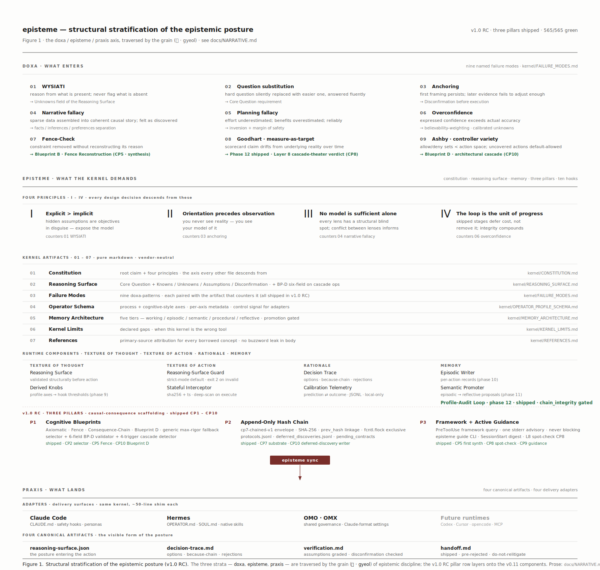

# cognitive-os

**A portable cognitive kernel for AI agents.** Markdown-first. Vendor-neutral. The kernel is what travels.

Most AI tooling is about *what the agent does.* `cognitive-os` is about *how it thinks* — before any tool, framework, or runtime gets involved. The kernel is [a small set of markdown files](./kernel/) that define the agent's worldview: the reasoning protocol it follows, the named counters to its most dangerous failure modes, and the schema for encoding an operator's cognitive preferences so they travel across tools and sessions.

> The body can be replaced. Tools change. Platforms come and go. But the question of *how to reason well under uncertainty* does not expire. That is what this project is about.

---

## See it in 60 seconds

The canonical shape of a cognitive-os deliverable — a reasoning surface, a decision trace, a verification, a handoff — is demonstrated end-to-end in `demos/`:

- **[demos/01_attribution-audit](./demos/01_attribution-audit/)** — the kernel applied to *itself*, auditing whether every borrowed concept (Kahneman's WYSIATI, Boyd's OODA, Popper's falsification, etc.) is traceable to a primary source. Real, reproducible, and the first reference implementation of the four-artifact workflow.

Open those four files in order. You will know what cognitive-os produces before you have to read any philosophy.

---

## I want to… → do this

| Goal                                                                           | Command / pointer                                             |
|--------------------------------------------------------------------------------|---------------------------------------------------------------|
| Understand what this project *is* in 3 minutes                                 | Read [`kernel/CONSTITUTION.md`](./kernel/CONSTITUTION.md)     |
| See what using it actually produces                                            | Open [`demos/01_attribution-audit/`](./demos/01_attribution-audit/) |
| Install on my machine                                                          | `pip install -e .` then `cognitive-os init`                   |
| Sync my operator profile to every AI tool I use                                | `cognitive-os sync`                                           |
| Encode my working style and reasoning posture                                  | `cognitive-os profile hybrid . --write && cognitive-os cognition survey --write` |
| Apply the right harness for an ML / web / data project                         | `cognitive-os detect . && cognitive-os harness apply <type> .` |
| Know when *not* to use this kernel                                             | Read [`kernel/KERNEL_LIMITS.md`](./kernel/KERNEL_LIMITS.md)   |
| Find attribution for any borrowed concept                                      | Read [`kernel/REFERENCES.md`](./kernel/REFERENCES.md)         |
| Audit whether my project is set up correctly                                   | `cognitive-os doctor`                                         |

---

## The lifecycle in one diagram

```
┌─────────────────────────────────────────────────────────────────────┐
│                         operator (you)                              │
│            ├── cognitive preferences  ├── working style             │
└──────────────────────────────┬──────────────────────────────────────┘
                               │
                    cognitive-os sync
                               │
      ┌────────────────────────┼────────────────────────┐
      ▼                        ▼                        ▼
 Claude Code             Hermes (OMO)            future adapter
 (CLAUDE.md)             (OPERATOR.md)           (same kernel)
      │                        │                        │
      └────────────────────────┼────────────────────────┘
                               │
                       per-session loop
                               │
      ┌────────┬────────┬──────┴─────┬────────┬────────┐
      ▼        ▼        ▼            ▼        ▼        ▼
    FRAME → DECOMPOSE → EXECUTE → VERIFY → HANDOFF → (next session)
      │                                        │
      │ Reasoning Surface                      │ docs/PROGRESS.md
      │ (Knowns / Unknowns /                   │ docs/NEXT_STEPS.md
      │  Assumptions / Disconfirmation)        │ decision artifact
      │                                        │
      └────────────── feedback ────────────────┘
```

Every element is the operational form of a kernel principle. The loop is the unit of progress (IV). Orientation precedes observation (II). Nothing hidden — Knowns, Unknowns, Assumptions, and Disconfirmation are made explicit before the action (I). Multiple lenses required at high-impact decisions (III).

---

## The kernel

Start here: **[`kernel/`](./kernel/)**

- **[CONSTITUTION.md](./kernel/CONSTITUTION.md)** — root claim, four principles, six failure modes.
- **[REASONING_SURFACE.md](./kernel/REASONING_SURFACE.md)** — the Knowns / Unknowns / Assumptions / Disconfirmation protocol.
- **[FAILURE_MODES.md](./kernel/FAILURE_MODES.md)** — six failure modes of fluent agents, each with its counter artifact.
- **[OPERATOR_PROFILE_SCHEMA.md](./kernel/OPERATOR_PROFILE_SCHEMA.md)** — schema for encoding an operator's cognitive preferences.
- **[KERNEL_LIMITS.md](./kernel/KERNEL_LIMITS.md)** — when the kernel is the wrong tool, and what gaps it does not yet close.
- **[REFERENCES.md](./kernel/REFERENCES.md)** — attribution for every load-bearing borrowed concept.

Pure markdown. No code. No vendor lock-in. The kernel does not care which runtime loads it.

---

## System overview

<p align="center">
  
</p>

Structural stack: kernel (philosophy) → operator profile (personalization) → adapters (delivery) → runtime (execution). Authority flows from specific to general: project docs > operator profile > kernel defaults > runtime defaults.

---

## Quick start

```bash
git clone https://github.com/junjslee/cognitive-os ~/cognitive-os
cd ~/cognitive-os
pip install -e .

cognitive-os init        # generate personal memory files from templates
cognitive-os sync        # push your identity to Claude Code and Hermes
cognitive-os doctor      # verify everything wired correctly
```

Expected output from `doctor`:
- `Awareness verified.`
- Claude Code and Hermes adapter checks shown as `[ok]` or `[info]`

### 60-second onboarding

```bash
cognitive-os profile hybrid . --write   # score your work style
cognitive-os cognition survey --write   # encode your reasoning posture
cognitive-os sync                       # push to all agents
cognitive-os doctor                     # verify
```

Every agent you open now inherits your memory, skills, and governance hooks.

### Project-type harness

```bash
cognitive-os detect .                         # analyze repo, recommend a harness
cognitive-os harness apply ml-research .      # apply it
# or in one shot:
cognitive-os new-project . --harness auto     # scaffold + auto-detect harness
```

---

## Three pillars

1. **Identity (the soul).** Persistent global profiles that define *who* the agent is — cognitive posture, reasoning depth, challenge orientation, operator preferences.
2. **Context (the harness).** Repo-specific operating environments that teach the agent *how* to think about your specific tech stack and constraints.
3. **Sync (the vessel).** Automated delivery that propagates identity + context into every tool you use, every session.

---

## How cognitive-os compares

Most tools in this space either build new agent runtimes or provide memory APIs for applications. `cognitive-os` does neither. It augments the developer tools you already use.

|                           | cognitive-os                                              | Manual per-tool files         | mem0 / OpenMemory                 | Agno (Phidata)                      | opencode / omo                            |
|---------------------------|-----------------------------------------------------------|-------------------------------|-----------------------------------|-------------------------------------|-------------------------------------------|
| **What it is**            | Identity + governance layer for your dev tools            | CLAUDE.md, AGENTS.md per repo | Memory API for AI applications    | Framework for building new agent apps | Open-source AI coding agent + harness       |
| **Approach**              | Augments existing tools (Claude Code, Hermes, …)          | Per-tool, per-project, manual | Embedded in application code      | Replaces tools with new agent runtime | Agent runtime; configs layered on top       |
| **Target**                | Devs who already use AI coding tools                      | Same, but no sync mechanism   | App developers embedding memory    | Teams building new AI applications    | Devs wanting an open-source Claude Code     |
| **Memory**                | Governed markdown + JSON schemas, authoritative           | Flat markdown, no schema       | Vector/graph store, API-managed    | Runtime-managed per agent              | Session-scoped, no persistent identity       |
| **Identity**              | Your profile, cross-tool, versioned                       | One file per tool, drifts      | Not a concept                      | Agent-level, defined per app           | System prompt per session                    |
| **Sync**                  | One command, all tools                                    | Manual copy-paste per tool     | N/A                                | N/A                                    | N/A (per-project config)                     |

The gap cognitive-os fills: no other project syncs a governed identity + cognitive contract across multiple developer AI tools in one command. mem0 and Agno own different lanes (application memory, agent app building). opencode and omo are excellent runtimes; cognitive-os makes them aware of who you are and how you think.

---

## Why this architecture

- **Cross-tool consistency.** One authoritative operating contract across Claude Code, Hermes, and future adapters.
- **Deterministic setup.** Profile/cognition onboarding is explainable (`survey` / `infer` / `hybrid`) instead of implicit drift.
- **Hard authority boundary.** Repo docs + global memory are the source of truth; tool-native memories are acceleration layers, not authorities.
- **Declared limits.** The kernel names when it is the wrong tool (`KERNEL_LIMITS.md`). A discipline without a boundary is a creed.

### Coexistence with self-evolving runtimes

`cognitive-os` is designed to work with agent runtimes that keep learning locally (Hermes memory/skills, Claude/Codex/Cursor local context):

1. Local runtime memory evolves fast during execution (high-velocity adaptation).
2. Durable lessons are promoted into authoritative files (`core/memory/global/*`, `docs/*`, reusable skills).
3. `cognitive-os sync` republishes that contract to every runtime.
4. Runtime-native memory remains a cache/acceleration layer, not the source of truth.

### Managed runtime positioning

`cognitive-os` and managed runtimes (e.g., Anthropic Managed Agents) are complementary:

- Managed runtime: execution substrate — orchestration, sandbox/tool execution, durable session/event logs.
- `cognitive-os`: cross-runtime cognitive control plane — identity, memory governance, authoritative docs, deterministic policy sync.

Run long tasks in a managed runtime; bridge session events into cognitive-os envelopes; promote durable lessons into authoritative docs; sync the updated contract back to all local runtimes.

---

## Repository layout

```
cognitive-os/
├── kernel/                     philosophy (markdown; travels across runtimes)
│   ├── CONSTITUTION.md         root claim, four principles, six failure modes
│   ├── REASONING_SURFACE.md    per-decision explicitness protocol
│   ├── FAILURE_MODES.md        named modes ↔ counter artifacts
│   ├── OPERATOR_PROFILE_SCHEMA.md  how operators encode their worldview
│   ├── KERNEL_LIMITS.md        when this kernel is the wrong tool
│   └── REFERENCES.md           attribution map for borrowed concepts
│
├── demos/                      end-to-end reference deliverables
│   └── 01_attribution-audit/   the kernel applied to itself
│
├── core/
│   ├── memory/global/          operator memory files (gitignored; personal)
│   ├── hooks/                  deterministic safety + workflow hooks
│   ├── harnesses/              per-project-type operating environments
│   └── schemas/                memory + evolution contract JSON schemas
│
├── adapters/                   kernel delivery layers (Claude Code, Hermes, …)
├── skills/                     reusable operator skills
├── templates/                  project scaffolds, example answer files
├── docs/                       runtime docs, architecture, contracts
├── src/cognitive_os/           CLI + core library
└── tests/
```

---

## CLI surface

```bash
cognitive-os init
cognitive-os doctor
cognitive-os sync [--governance-pack minimal|balanced|strict]
cognitive-os new-project [path] --harness auto
cognitive-os detect [path]
cognitive-os harness apply <type> [path]
cognitive-os profile [survey|infer|hybrid] [path] [--write]
cognitive-os cognition [survey|infer|hybrid] [path] [--write]
cognitive-os setup [path] [--interactive] [--governance-pack minimal|balanced|strict] [--write] [--sync] [--doctor]
cognitive-os bridge anthropic-managed --input <managed-events.json> [--project-id <id>] [--dry-run]
cognitive-os evolve [run|report|promote|rollback] ...
```

Full reference: `docs/README.md`.

| Task                         | Command                                                            |
|------------------------------|--------------------------------------------------------------------|
| Initialize personal files    | `cognitive-os init`                                                |
| Push memory to all agents    | `cognitive-os sync`                                                |
| New project from scaffold    | `cognitive-os new-project [path]`                                  |
| Detect / apply harness       | `cognitive-os detect` \| `cognitive-os harness apply <type>`       |
| Deterministic onboarding     | `cognitive-os setup . --interactive`                               |
| Verify system health         | `cognitive-os doctor`                                              |

---

## What gets synced

| Asset                                                              | Claude Code   | Hermes                      | OMO / OMX |
|--------------------------------------------------------------------|---------------|-----------------------------|-----------|
| Global memory index (`CLAUDE.md`)                                  | ✅            | —                           | —         |
| Operator / cognitive / workflow sources (`core/memory/global/*.md`)| via include   | composed into `OPERATOR.md` | —         |
| Agent personas                                                     | ✅            | —                           | ✅        |
| Skills                                                             | ✅            | ✅                          | ✅        |
| Lifecycle hooks                                                    | ✅            | —                           | ✅        |
| Authoritative context composite (`OPERATOR.md`)                    | —             | ✅                          | —         |

Matrix describes current adapter capabilities, not architectural authority. Authoritative truth remains in repository docs and global cognitive-os memory.

---

## Deterministic safety hooks (Claude adapter)

Hooks run deterministically — the model cannot override them.

Governance packs for `sync` / `setup --sync`:
- `minimal` — baseline safety hooks only (`block_dangerous`, formatter/test/checkpoint/quality gate)
- `balanced` (default) — `minimal` + workflow/context/prompt advisories
- `strict` — `balanced` + removes generic `PermissionRequest` auto-allow fallback while preserving custom permission hooks

| Hook                    | Event                                                 | What it does                                                                                    |
|-------------------------|-------------------------------------------------------|-------------------------------------------------------------------------------------------------|
| `session_context.py`    | `SessionStart`                                        | Prints branch, git status, and `NEXT_STEPS.md` at session open                                  |
| `block_dangerous.py`    | `PreToolUse Bash`                                     | Blocks `rm -rf`, `git reset --hard`, `git push --force`, `sudo`, `pkill`, and more              |
| `workflow_guard.py`     | `PreToolUse Write\|Edit\|MultiEdit`                   | Advisory nudge to keep `docs/PLAN.md`, `PROGRESS.md`, `NEXT_STEPS.md` aligned with edits        |
| `prompt_guard.py`       | `PreToolUse Write\|Edit\|MultiEdit`                   | Advisory detection of prompt-injection patterns when writing durable context                    |
| `format.py`             | `PostToolUse Write\|Edit`                             | Auto-runs `ruff` (Python) or `prettier` (JS/TS) after every file write                          |
| `test_runner.py`        | `PostToolUse Write\|Edit`                             | Runs pytest / jest on the file if it is a test file                                             |
| `context_guard.py`      | `PostToolUse Bash\|Edit\|Write\|MultiEdit\|Agent\|Task`| Advisory warning when session context approaches compaction thresholds                          |
| `quality_gate.py`       | `Stop`                                                | Blocks completion if tests fail (opt-in via `.quality-gate` in project root)                    |
| `checkpoint.py`         | `Stop`                                                | Auto-commits uncommitted changes as `chkpt:` after every turn                                   |
| `precompact_backup.py`  | `PreCompact`                                          | Backs up session transcripts before context compaction                                          |

---

## Skills included

**Custom (your own):** `repo-bootstrap` · `requirements-to-plan` · `progress-handoff` · `worktree-split` · `bounded-loop-runner` · `review-gate` · `research-synthesis`

**Vendor (curated upstream):** `swing-clarify` · `swing-options` · `swing-research` · `swing-review` · `swing-trace` · `swing-mortem` · `create-prd` · `sprint-plan` · `pre-mortem` · `test-scenarios` · `prioritization-frameworks` · `retro` · `release-notes`

Add your own skills under `skills/custom/` — each is a folder with a `SKILL.md`.

---

## Agent personas included

Eleven subagent definitions installed into `~/.claude/agents/`:

- **Execution:** `planner` · `researcher` · `implementer` · `reviewer` · `test-runner` · `docs-handoff`
- **Structural governance:** `domain-architect` · `reasoning-auditor` · `governance-safety` · `orchestrator` · `domain-owner`

---

## Project scaffold

`cognitive-os new-project [path]` creates a standard project structure:

```
AGENTS.md            vendor-neutral operating manual for any agent
CLAUDE.md            Claude-native memory index
docs/
  REQUIREMENTS.md    what is being built
  PLAN.md            staged execution
  PROGRESS.md        completed work and decisions
  NEXT_STEPS.md      next-session handoff
  RUN_CONTEXT.md     runtime assumptions, APIs, execution profiles
  DECISION_STORY.md  narratable what/why/how for major decisions
.claude/
  settings.json          permission rules
  settings.local.json    machine-local overrides (gitignored)
```

---

## Memory model

```
global memory (this repo)
└── stable cross-project context: who you are, how you work, safety policy

project memory (each repo's docs/)
└── what is being built, current state, next handoff, decision story

episodic memory (session/run traces)
└── observations, decisions, verification outcomes for replay and audit

plugin memory (claude-mem, etc.)
└── cache and retrieval — never the authoritative record
```

Global memory never belongs in chat. Project memory never belongs in global. Plugins help but don't replace either.

### Memory Contract v1

Formal schema + conflict semantics for portable integrations: `docs/MEMORY_CONTRACT.md`, schemas at `core/schemas/memory-contract/*.json`.

- Required provenance fields (`source_type`, `source_ref`, `captured_at`, `captured_by`, `confidence`)
- Explicit memory classes (`global`, `project`, `episodic`)
- Conflict order (`project > global > episodic`, then status/recency/confidence, with human override)
- Additive bridges for external runtimes (`cognitive-os bridge anthropic-managed`) that transform runtime events into memory-contract envelopes without changing existing sync behavior

### Evolution Contract v1

Safe self-improvement loop: `docs/EVOLUTION_CONTRACT.md`, schemas at `core/schemas/evolution/*.json`.

1. Generator proposes bounded mutation
2. Critic attempts disconfirmation
3. Deterministic replay + evaluation
4. Promotion gates decide pass/fail
5. Human-approved promotion + rollback reference

---

## Customization

### Personal memory

Edit `core/memory/global/*.md` — these are gitignored and never leave your machine. The `*.example.md` files in the same directory are committed templates showing what belongs in each.

Recommended additions:
- `core/memory/global/build_story.md` from `build_story.example.md` — a short, stable builder narrative (not project-specific).

### Skills

- `skills/custom/` — your own skills
- `skills/vendor/` — curated upstream skills (declare in `runtime_manifest.json`)
- `skills/private/` — experimental skills that never sync globally

### Hooks

Edit scripts in `core/hooks/`. All hooks run with your Conda Python — no extra dependencies. Paths resolve dynamically so the same scripts work on any machine.

### Conda root

```bash
export COGNITIVE_OS_CONDA_ROOT=/path/to/your/conda   # default: ~/miniconda3
```

---

## Harness system

A **harness** defines the operating environment for a specific project type — execution profile, workflow constraints, safety notes, recommended agents. A generic scaffold gives every project the same shape; a harness gives it the right shape.

```bash
cognitive-os detect .
```

```
Analyzing /your/project ...

Harness scores:

ml-research            score 11  ← recommended
· dependency: torch
· dependency: transformers
· file: **/*.ipynb (3+ found)
· directory: checkpoints/

Recommended: ml-research
cognitive-os harness apply ml-research .
```

Applying a harness writes `HARNESS.md` to the project root and extends `docs/RUN_CONTEXT.md` with profile-specific context — GPU constraints, cost acknowledgment requirements, data safety rules, or dev-server reminders, depending on type.

| Harness          | Best for                                                                        |
|------------------|---------------------------------------------------------------------------------|
| `ml-research`    | PyTorch / JAX / HuggingFace projects, GPU training, experiment tracking         |
| `python-library` | Packages and libraries intended for distribution or reuse                       |
| `web-app`        | React / Vue / Next.js frontends with optional backend                           |
| `data-pipeline`  | ETL, dbt, Airflow, Prefect, analytics workflows                                 |
| `generic`        | Everything else                                                                 |

Add your own by dropping a JSON file into `core/harnesses/`.

---

## Deterministic profile + cognition setup

`cognitive-os profile` and `cognitive-os cognition` are deterministic onboarding layers:

- **profile** — how work runs (planning, testing, docs, automation)
- **cognition** — how decisions are made (reasoning depth, challenge style, uncertainty posture)

Treat survey/infer outputs as a starting point, not doctrine. For long-term quality, manually author your authoritative philosophy in `core/memory/global/cognitive_profile.md` using a top-down structure (reasoning → agency → adaptation → governance → operating thesis), then sync.

Modes:
- `survey` — explicit questionnaire, 4-level choices mapped to scores 0..3
- `infer` — deterministic repo-signal scoring (docs/tests/CI/branch patterns/guardrails)
- `hybrid` — weighted merge (`60% survey + 40% infer`, rounded)

Tip: `survey` and `hybrid` accept `--answers-file templates/profile_answers.example.json` for non-interactive runs.

Scored dimensions (all 0..3):

**Workstyle profile:** `planning_strictness`, `risk_tolerance`, `testing_rigor`, `parallelism_preference`, `documentation_rigor`, `automation_level`.

**Cognitive profile:** `first_principles_depth`, `exploration_breadth`, `speed_vs_rigor_balance`, `challenge_orientation`, `uncertainty_tolerance`, `autonomy_preference`.

```bash
cognitive-os profile survey --answers-file templates/profile_answers.example.json
cognitive-os profile infer .
cognitive-os profile hybrid . --answers-file templates/profile_answers.example.json --write
cognitive-os profile show
```

Generated artifacts:
- `core/memory/global/.generated/workstyle_profile.json`
- `core/memory/global/.generated/workstyle_scores.json`
- `core/memory/global/.generated/workstyle_explanations.md`
- `core/memory/global/.generated/personalization_blueprint.md`

### One-command setup (execution + thinking)

```bash
cognitive-os setup . --interactive
cognitive-os setup . --write --sync --governance-pack strict --doctor

# fully scripted
cognitive-os setup . \
  --profile-mode hybrid \
  --cognition-mode infer \
  --profile-answers-file templates/profile_answers.example.json \
  --cognition-answers-file templates/profile_answers.example.json \
  --write --overwrite --sync --doctor
```

Defaults: non-interactive uses `infer` for both; interactive prompts whether to use questionnaire onboarding; `write`, `overwrite`, `sync`, `doctor` default to `false` (preview first); `governance-pack=balanced` when `--sync` enabled.

---

## Quick terminal tools (strongly recommended)

Agents running under cognitive-os use these for search, discovery, and inspection:

- `rg` (ripgrep) — codebase search; fast, respects `.gitignore`, structured output
- `fd` — file discovery; cleaner interface than `find`, predictable behavior
- `bat` — file inspection with syntax highlighting and line numbers
- `sd` — safer regex in-place replacements
- `ov` — pager that handles wide output and ANSI without mangling

`rg`, `fd`, `bat` are treated as local-only and verified by `cognitive-os doctor`.

---

## Push-readiness checklist

Before publishing:
- `PYTHONPATH=. pytest -q tests/test_profile_cognition.py`
- `python3 -m py_compile src/cognitive_os/cli.py`
- `cognitive-os doctor`
- `git status` and `git rev-list --left-right --count @{u}...HEAD`

If these pass, the repo is in a clean, reproducible state for push.

---

## Vendor skill provenance (inspired, not copied)

- Required vendor attribution map: `skills/vendor/SOURCES.md`
- Every vendor skill should include a `## Provenance` section in `SKILL.md` when imported/adapted
- Run `cognitive-os validate` to surface manifest/provenance warnings before shipping

---

## Read this next

- Kernel (start here): [`kernel/`](./kernel/)
- Governing philosophy: [`kernel/CONSTITUTION.md`](./kernel/CONSTITUTION.md)
- What the kernel *produces*: [`demos/01_attribution-audit/`](./demos/01_attribution-audit/)
- What the kernel *will not do well*: [`kernel/KERNEL_LIMITS.md`](./kernel/KERNEL_LIMITS.md)
- Docs index: `docs/README.md`
- Architecture: `docs/COGNITIVE_OS_ARCHITECTURE.md`
- Cognitive System Playbook: `docs/COGNITIVE_SYSTEM_PLAYBOOK.md`
