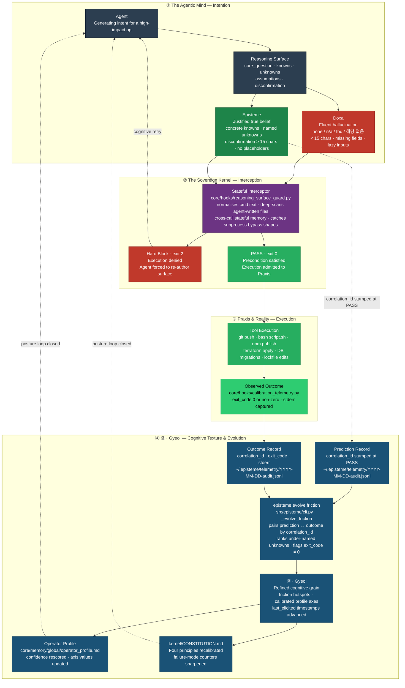

# Architecture — The Sovereign Kernel (v0.12.0)

> Mermaid flowchart. Renders natively on GitHub, Obsidian, and any CommonMark viewer with Mermaid support. Four subgraphs trace the full lifecycle from agent intention to calibrated cognitive evolution.

---



---

## Node annotations

### ① The Agentic Mind — Intention

| Node | Role | Key constraint |
|------|------|----------------|
| **Agent** | LLM generating a tool-call intent for a high-impact op | Any `git push`, `npm publish`, `terraform apply`, DB migration, or lockfile edit triggers the guard |
| **Reasoning Surface** | Structured precondition: `core_question`, `knowns`, `unknowns`, `assumptions`, `disconfirmation` | Defined in `kernel/REASONING_SURFACE.md` |
| **Doxa** | Default LLM output — fluent but unvalidated | Fails if any field is a lazy placeholder (`none`, `n/a`, `tbd`, `해당 없음`) or < 15 chars |
| **Episteme** | Validated surface — concrete, falsifiable | All four fields filled, no placeholders, `disconfirmation` ≥ 15 chars |

### ② The Sovereign Kernel — Interception

| Node | Implementation | Mechanism |
|------|---------------|-----------|
| **Stateful Interceptor** | `core/hooks/reasoning_surface_guard.py` (614 lines) | Normalises command text before pattern-matching (catches `subprocess.run(['git','push'])` and `os.system('git push')` bypass shapes); performs deep-scan of recently agent-written files to defeat variable-indirection bypasses; maintains cross-call memory |
| **Hard Block** | exit 2 | PreToolUse hook returns non-zero; Claude Code denies execution and presents the block message; agent must re-author surface |
| **PASS** | exit 0 | Surface validated; execution proceeds to Praxis; `correlation_id` stamped into the prediction record at this boundary |

Advisory mode (warn-don't-block) is opt-in per-project: `touch .episteme/advisory-surface`.

### ③ Praxis & Reality — Execution

| Node | Implementation |
|------|---------------|
| **Tool Execution** | The actual shell command admitted to the runtime — `git push`, `bash script.sh`, `npm publish`, `terraform apply`, DB migrations, lockfile edits |
| **Observed Outcome** | `core/hooks/calibration_telemetry.py` fires as a PostToolUse hook; captures `exit_code`, `stderr`, and duration; writes the outcome record with the same `correlation_id` used in the prediction record |

### ④ 결 · Gyeol — Cognitive Texture & Evolution

| Node | Implementation | Detail |
|------|---------------|--------|
| **Prediction Record** | `~/.episteme/telemetry/YYYY-MM-DD-audit.jsonl` | Written by `reasoning_surface_guard.py` at PASS; contains `correlation_id`, surface snapshot, timestamp |
| **Outcome Record** | Same JSONL file | Written by `calibration_telemetry.py` PostToolUse; contains same `correlation_id`, `exit_code`, `stderr` |
| **episteme evolve friction** | `src/episteme/cli.py` · `_evolve_friction()` | Pairs prediction ↔ outcome records by `correlation_id`; identifies unknowns the operator repeatedly under-names; flags `exit_code ≠ 0` for surface fields that failed to anticipate failure |
| **결 · Gyeol** | Derived calibration signal | Refined cognitive grain: per-field friction scores, operator-profile axis drift signals, failure-mode firing frequencies |
| **Operator Profile** | `core/memory/global/operator_profile.md` | Axis values updated; `last_elicited` timestamps advanced; `confidence` fields rescored from `inferred` → `elicited` where evidence accumulates |
| **CONSTITUTION.md** | `kernel/CONSTITUTION.md` | Four principles and nine failure-mode counters recalibrated against observed friction — the kernel document that governs all future Agent mind states |

---

## Colour legend

| Colour | Meaning |
|--------|---------|
| Red | Doxa — unvalidated output, or Hard Block — execution denied |
| Green | Episteme / Praxis — validated surface or admitted execution |
| Blue | Gyeol — calibration telemetry and cognitive evolution |
| Purple | Sovereign Kernel — the stateful interceptor |
| Dark grey | Neutral infrastructure — Agent and Reasoning Surface |

---

## The feedforward contract

```
Preconditions  →  core_question + knowns + unknowns + disconfirmation (all concrete)
Postconditions →  Observed Outcome paired with Prediction by correlation_id
Invariants     →  kernel/CONSTITUTION.md — cannot be suspended per-cycle
```

Nothing executes until preconditions hold. Nothing evolves until postconditions are verified. The kernel's four principles are invariants — not guidelines. This is Design by Contract (Bertrand Meyer) applied to agent cognition.

---

## Cross-references

- Stateful Interceptor: `core/hooks/reasoning_surface_guard.py`
- Calibration Telemetry: `core/hooks/calibration_telemetry.py`
- CLI friction analysis: `src/episteme/cli.py` · `_evolve_friction()`
- Operator Profile schema: `kernel/OPERATOR_PROFILE_SCHEMA.md`
- Kernel constitution: `kernel/CONSTITUTION.md`
- Failure modes: `kernel/FAILURE_MODES.md`
- Reasoning Surface protocol: `kernel/REASONING_SURFACE.md`
- Narrative spine (doxa / episteme / praxis / 결): `docs/NARRATIVE.md`
